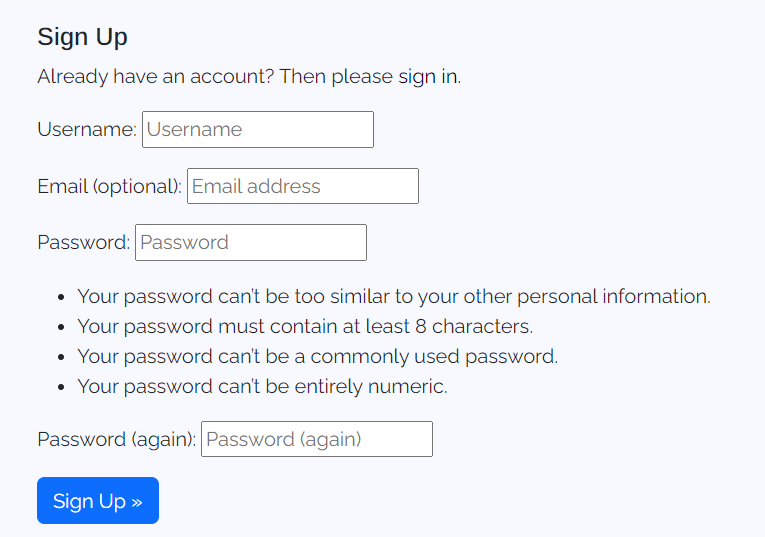
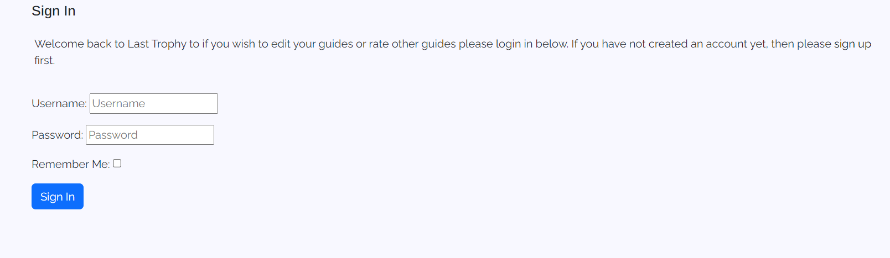

# Last Trophy 

Welcome to Last Trophy this project was created using HTML, CSS, JavaScript and Django the main premise of this project is to help users with Trophy hunting this application will allow users to view achievement guides, create an account, comment, rate other guides and more more features that will be showcased down below.

## CONTENTS

- [Last Trophy](#last-trophy)
    - [CONTENTS](#contents)
    - [UX](#ux)
        - [Strategy Plane](#the-strategy-plane)
            - [Site Goals](#site-goals)
            - [Epics](#epics)
            - [User Stories](#user-stories-list)
        - [Scope Plane](#the-scope-plane)
        - [Structure Plane]()
            - [Opportunities](#opportunities)
        - [Skeleton Plane](#the-skeleton-plane)
            - [Wireframes](#wireframes)
                - [GameList Wireframe](#games-list-wireframe)
                - [Sign up Wireframe](#sign-up-wireframe)
                - [Login Wireframe](#login-wireframe)
                - [User Guides wireframe](#user-guides-wireframe)
            - [Database Schema](#database-schema)
            - [Color Palette](#color-palette)
            - [Typography](#typography)
                - [Headings](#headingss)
                - [Body](#body)
        - [Surface Plane]()
            - [Key Features](#key-features)
                - [Navigation Bar](#navigation-bar)
                    - [Mobile Navigation View](#mobile-navigation-view)
                    - [Desktop Navigation View](#desktop-navigation-view)
                - [Games List](#games-list)
                    - [Mobile Games view](#mobile-games-view)
                    - [Desktop Games view](#desktop-games-view)
                - [Sign up](#sign-up-page)
                    - [Mobile Sign up view](#mobile-sign-up-view)
                    - [Desktop Sign up view](#desktop-sign-up-view)
                - [Sign in](#login-in-page)
                    - [Mobile login view](#mobile-sign-in-view)
                    - [Desktop login view](#desktop-sign-in-view)
                - [User Guides](#user-guides)
                    - [Mobile user guides view](#mobile-user-guides-view)
                    - [Desktop user guides view](#desktop-user-guides-view)
                - [Categories](#categories)
                    - [Mobile Categories view](#mobile-category-view)
                    - [Desktop Categories view](#desktop-category-view)
                - [Favicon](#favicon)
                    [Desktop favicon view](#desktop-favicon-view)
        - [Technology](#technology)
            - [Languages](#languages)
                - [Frameworks & Tools](#frameworks--tools)
        - [Deployment](#deployment)
            - [Credits](#credits)
            - [Acknowledgements](#acknowledgements)

                    

[To view the deployed project click here](https://last-trophy-f32c1bd6dcec.herokuapp.com/)

## UX

### The Strategy Plane

#### Site Goals

#### Epics

#### User Stories list

### The Scope Plane

#### Opportunities

### The Skeleton Plane

#### Wireframes

##### Games List Wireframe

##### Sign up Wireframe

##### Login Wireframe

##### User Guides Wireframe

## DataBase Relationship Models

### Database Schema

### Games Model

### User Model

### Comment Model

### Guides Model

## Design Plane

### Color Palette

This is the Color Palette I decided to go with, there are five colours of choice red will be used for the errors on the application and delete buttons, while the green will be used for any login or sign up buttons. There will also be a blue colour that is used for upvoting other user guides. While the white will be used for the background the application has a very simplistic look to not take away any attention from the content on the application.

## Typography

### Headings

### Body

## Key Features

### Navigation Bar

This feature will collapse on mobiles and stretch on desktops, allowing users to click on the the game title leading them to the categories, clicking register to create an account or click login to login to an exisiting account.

#### Mobile Navigation view

#### Desktop Navigation view

### Games List

This element will be shown to the user once they have clicked on a game showing the games rating the amount of trophies and how long it could take to unlock every trophy. Underneath this information the games trophies will be listed below showing a brief description how to unlock this trophy.

#### Mobile Games view

#### Desktop Games view

### Sign up page
The sign up page will be showcased to the user allowing them to create an account to gain access to the features of the last trophy site such as creating guides, editing there own guides and deleting there own guides. They will also be able to provide feedback to other users such as adding comments and liking and disliking guides.

#### Mobile Sign up view

#### Desktop Sign up view

### Login in Page

The login page will be showcased to the user, allowing them to login to an existing account to review the guides they have created, create other guides or respond to feedback.

#### Mobile Sign in view

#### Desktop Sign in view

### User Guides

This page will allow the user to view the exisiting guides, create a new guide, delete there guides if logged in or edit there guides if logged in.

#### Mobile User Guides view

When there is a guide created this view will be shown if the user is not logged in

When there is a guide created this view will be shown if the user is logged in

When there isnt a guide created this view will be shown if the user is not logged in

When there isnt a guide created this view will be shown if the user is logged in

If the site user is the admin user this view will be shown

#### Desktop User Guides view

When there is a guide created this view will be shown if the user is not logged in

When there is a guide created this view will be shown if the user is logged in

When there isnt a guide created this view will be shown if the user is not logged in

When there isnt a guide created this view will be shown if the user is logged in

If the site user is the admin user this view will be shown

### Categories 

#### Mobile Category view
This is the form and form results view on mobile.

#### Desktop Category view

This is the form and form results view on desktop

### Favicon

This will be shown when the user is on the webpage the design is very simple a trophy symbolising what the application is about.

#### Mobile Favicon view

#### Desktop Favicon view

## Technology 

### Languages

#### Frameworks & Tools

## Deployment

## Credits

## Acknowledgements
