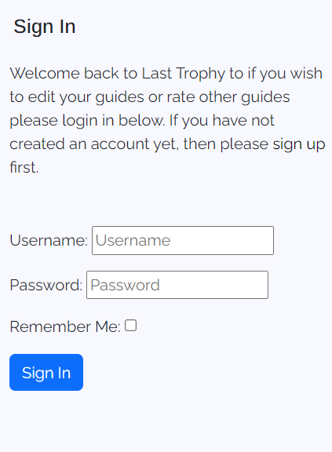

# Last Trophy 

Welcome to Last Trophy this project was created using HTML, CSS, JavaScript and Django the main premise of this project is to help users with Trophy hunting this application will allow users to view achievement guides, create an account, comment, rate other guides and more more features that will be showcased down below.

## CONTENTS

[To view the deployed project click here](https://last-trophy-f32c1bd6dcec.herokuapp.com/)

## UX

### The Strategy Plane

### Site Goals

### Epics

### User Stories

### The Scope Plane

#### Opportunities

### The Skeleton Plane

## DataBase Relationship Models

### Database Schema

### Games Model

### User Model

### Comment Model

### Guides Model

## Design Plane

### Color Palette

This is the Color Palette I decided to go with, there are five colours of choice red will be used for the errors on the application and delete buttons, while the green will be used for any login or sign up buttons. There will also be a blue colour that is used for upvoting other user guides. While the white will be used for the background the application has a very simplistic look to not take away any attention from the content on the application.

## Typography

### Headings

### Body

## Key Features

### Navigation Bar

This feature will collapse on mobiles and stretch on desktops, allowing users to click on the the game title leading them to the categories, clicking register to create an account or click login to login to an exisiting account.

#### Mobile view

#### Desktop view

### Games List

This element will be shown to the user once they have clicked on a game showing the games rating the amount of trophies and how long it could take to unlock every trophy. Underneath this information the games trophies will be listed below showing a brief description how to unlock this trophy.

#### Wireframes

#### Mobile view

#### Desktop view

### Sign up page
The sign up page will be showcased to the user allowing them to create an account to gain access to the features of the last trophy site such as creating guides, editing there own guides and deleting there own guides. They will also be able to provide feedback to other users such as adding comments and liking and disliking guides.

#### Wireframes

#### Mobile view

#### Desktop view

### Login in Page

The login page will be showcased to the user, allowing them to login to an existing account to review the guides they have created, create other guides or respond to feedback.

#### Wireframes

#### Mobile view

#### Desktop view

### User Guides

This page will allow the user to view the exisiting guides, create a new guide, delete there guides if logged in or edit there guides if logged in.

#### Wireframes

#### Mobile view

When there is a guide created this view will be shown if the user is not logged in

When there is a guide created this view will be shown if the user is logged in

When there isnt a guide created this view will be shown if the user is not logged in

When there isnt a guide created this view will be shown if the user is logged in

If the site user is the admin user this view will be shown

#### Desktop view

When there is a guide created this view will be shown if the user is not logged in

When there is a guide created this view will be shown if the user is logged in

When there isnt a guide created this view will be shown if the user is not logged in

When there isnt a guide created this view will be shown if the user is logged in

If the site user is the admin user this view will be shown

### Categories 

#### Mobile view
This is the form and form results view on mobile.

#### Desktop view

This is the form and form results view on desktop

### Favicon

This will be shown when the user is on the webpage the design is very simple a trophy symbolising what the application is about.

#### Mobile view

#### Desktop view

## Technology 

### Languages

#### Frameworks & Tools

## Testing

- Fixed function attribute error by going back into the trophy model and adjusting some key values such as the related name component and the trophy field name on the game model.
- Fixed an error where the trophies were not appearing, after completing the migrations for the model changes this fixed this issue.
- Fixed Slug field error by renaming the slug field to include a slug field and not a char field which fixed this issue.
- Fixed view error by first seperating the category and genre model into the trophy hunter app, I did this so I could reference the game model to link the game to the category. After this in the category view I imported the trophy hunter model and in particular the categories model so I could reference the model and then created the view. There was an issue with the url to fix this I added the url to the project and created the url within the category app which fixed the view error.
- Fixed migrations database model bugs where a field already existed to fix this I deleted the existing migrations and created the database model again.
- Fixed database already exists error by deleting all database models and creating them again starting with the genre model as when trying to delete the game orginally this would clash with the genre model not allowing me to create or add new migrations to the database model. Deleting and creating the models and the model structure again fixed this issue.
- Fixed slug errors by adjusting spelling mistakes to make sure the correct slug was being loaded.
- Fixed a bug where the games were not being seperated into different genres to fix this I created a form and used a table to allow the user to specify which genre, game title or trophy count they were looking for. Once this was done I was able to use the slug url to then allow the user to click on the game title, which takes the user to the game details, such as the trophies and where the written guides will be. The creation of the genre form fixed these errors.
- Had many errors when trying to link the guides to the game model, at first doing this showcased this under every trophy which was not the intended behaviour, to fix this I first added a slug field to the trophy model and then created a slug for all the trophies. After this I created a new app called guides and created a new view, new urls and a new template called guide_detail. Doing this allowed me to access the trophy slug url and link this to the trophy title, which showcased the correct guides under the correct trophies which fixed the guides errors.
- Fixed Warning errors for all urls that had a slash before the pathway removing the slash removed this warning.
- Fixed front end guide bugs originally when I was trying to use the create view class, this did not work as the slug could not be found. I tried to make a new function with a request and recieving the guide id. This did not work as the fields were appearing as being null, in order to fix this I went back to the create view solution and changed the spelling from trophies to trophy which targeted the right slug and fixed this issue.
- Fixed an error where the trophy  needed to be selected, to fix this I added a function called form valid, which would get the value of the primary key of the trophy I had clicked on, which set the trophy title to the one I clicked on which fixed this issue.
- Fixed redirect error originally the create guide view was redirecting the user to the game form, which wasnt a good user experience (UX). To fix this I created a new function called get success url, and then used the function name to get the url and dot notation to get the trophy model and its slug. Which redirected the user to the page they were visiting which fixed this error.
- Fixed update view error when I was trying to edit the current guide again the url was trying to access the same pathway. To fix this I changed the form pk from the trophy pk to the guide pk which fixed this issue.
- Fixed an error where the styling for the guide form was not stying with bootstrap or css. To fix this I went back to the forms.py file for the guide form, created a widgets dictionary for all the form fields. I also used the class form-control which loaded the bootstrap styling for the form fixing this issue.
- Fixed guide if statement by starting the if statement before the for loop, before this the intended behavoiour was not working placing the if statement before the for loop and placing the for loop inside the if statement as part of the else condition fixed this error.
- Fixed create guide bugs, the user could click create guide without being signed in with an error appearing stating no user defined. In order to fix this I added two if statements to first determine if there were any guides created, if there were the first if statement checked if there were no guides and the user was not logged in, if that was the case a login below button appeared for the user to log in. To make sure the user could not login twice I changed the login button to a create guide button to make sure the user could not login twice. After this the button and text would change asking the user to create a guide if there were no guides created.
- Fixed the last create guide error, the error orginally occured when there were guides created and the user was not logged in. To fix this I created another if statement which checked if there were guides created and if the user was not logged in to login. Otherwise the user can create a guide which fixed these erorrs.
- Fixed python structure bugs by changing how many characters a specific line of code was, adding extra space and removing empty white lines etc which fixed these errors.
- Fixed 500 error which was not displaying correctly because  there were to many arguments in the function, to fix this I removed the exception argument which fixed this issue.
- Fixed create view error when trying to use user permission mixin. The logic I was using was trying to get the author of the guide and match that with the logged in user, when there wasn't one. To fix this I added the login required mixin which redirected the user to the login page, once logged in the users was  then able to create a guide.
- Fixed guide bugs I was unable to reference the specific trophy in the guide view, to fix this I changed the trophy.title to trophies which referenced the spelling in the view which loaded the specific trophy to the web page.
- Fixed user authentication create game error, orginally the create game button would not appear regardless of which user was logged in. In order to fix this I added an if statement making sure the user was the superuser user which checked if the logged in user was the super user, if they are the button would show allowing the admin user to create a game in the front end.
- Fixed approving guide bugs orginally the guides awaiting approval were not being shown. To fix this I created a new template and a new view to sort the guides awaiting apporval as approved equals false. I displayed this in a list view. To then approve the guides I created a new form which used the approved field where the admin user can tick this box to approve the guide which is then added to the trophy fixing this issue.
- Fixed Guide model does not have the guide attribute. Orginally I was trying to access the guides primary key in the success url and the guide attribute did not exist, in order to fix this I changed the success url to the url not approved guides. Which returned the admin user to the unapproved guides page fixing this issue.
## Deployment

## Credits

## Acknowledgements
