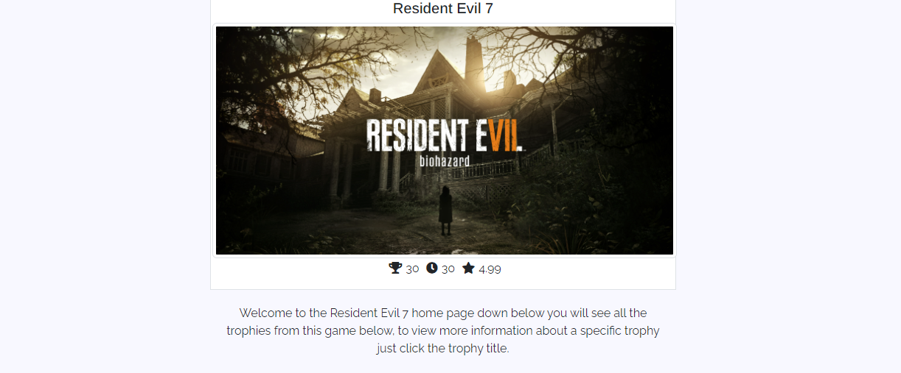
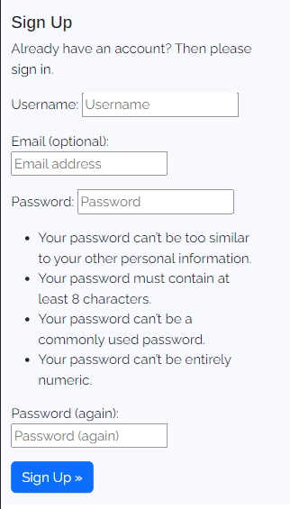
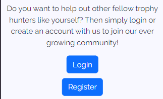
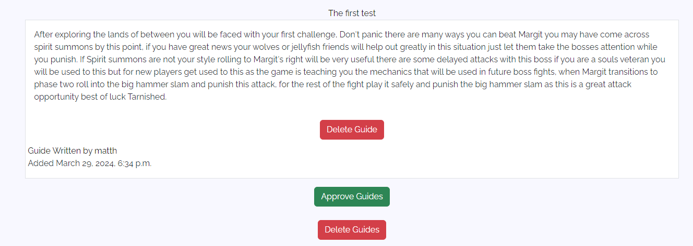

# Last Trophy 

Welcome to Last Trophy this project was created using HTML, CSS, JavaScript and Django the main premise of this project is to help users with Trophy hunting this application will allow users to view achievement guides, create an account, comment, rate other guides and more more features that will be showcased down below.

## CONTENTS

- [Last Trophy](#last-trophy)
    - [CONTENTS](#contents)
    - [UX](#ux)
        - [Strategy Plane](#the-strategy-plane)
            - [Site Goals](#site-goals)
            - [Epics](#epics)
            - [User Stories](#user-stories-list)
        - [Scope Plane](#the-scope-plane)
        - [Structure Plane]()
            - [Opportunities](#opportunities)
        - [Skeleton Plane](#the-skeleton-plane)
            - [Wireframes](#wireframes)
                - [GameList Wireframe](#games-list-wireframe)
                - [Sign up Wireframe](#sign-up-wireframe)
                - [Login Wireframe](#login-wireframe)
                - [User Guides wireframe](#user-guides-wireframe)
            - [Database Schema](#database-schema)
            - [Color Palette](#color-palette)
            - [Typography](#typography)
                - [Headings](#headingss)
                - [Body](#body)
        - [Surface Plane]()
            - [Key Features](#key-features)
                - [Navigation Bar](#navigation-bar)
                    - [Mobile Navigation View](#mobile-navigation-view)
                    - [Desktop Navigation View](#desktop-navigation-view)
                - [Games List](#games-list)
                    - [Mobile Games view](#mobile-games-view)
                    - [Desktop Games view](#desktop-games-view)
                - [Sign up](#sign-up-page)
                    - [Mobile Sign up view](#mobile-sign-up-view)
                    - [Desktop Sign up view](#desktop-sign-up-view)
                - [Sign in](#login-in-page)
                    - [Mobile login view](#mobile-sign-in-view)
                    - [Desktop login view](#desktop-sign-in-view)
                - [User Guides](#user-guides)
                    - [Mobile user guides view](#mobile-user-guides-view)
                    - [Desktop user guides view](#desktop-user-guides-view)
                - [Categories](#categories)
                    - [Mobile Categories view](#mobile-category-view)
                    - [Desktop Categories view](#desktop-category-view)
                - [Favicon](#favicon)
                    [Desktop favicon view](#desktop-favicon-view)
        - [Technology](#technology)
            - [Languages](#languages)
                - [Frameworks & Tools](#frameworks--tools)
        - [Deployment](#deployment)
            - [Credits](#credits)
            - [Acknowledgements](#acknowledgements)

                    

[To view the deployed project click here](https://last-trophy-f32c1bd6dcec.herokuapp.com/)

## UX

### The Strategy Plane

#### Site Goals

This site intends to help users unlocking trophies with users being able to create accounts, create there own guides, leave feedback to other users, like and dislike guides to provide feedback to other users and join an ever growing community of trophy hunters.

* To allow users to join an ever growing community
* Create and edit, delete there own guides
* Up vote guides they find useful
* Dislike guides they do not find useful
* Help users to unlock difficult trophies with detailed guides

#### Epics

I created seven epics which were then developed into User stories, every detail regarding the epics and the user stories can be found on the Last Trophy kanban board which can be found at the following [link](https://github.com/users/mattthughes/projects/3)

* Inital Django Project Setup [[#12](https://github.com/mattthughes/Last-Trophy/issues/12)]
* User Profile [[#13](https://github.com/mattthughes/Last-Trophy/issues/13)]
* User Sign in or sign out [[#14](https://github.com/mattthughes/Last-Trophy/issues/14)]
* User Guides [[#15](https://github.com/mattthughes/Last-Trophy/issues/15)]
* Games Searching[[#16](https://github.com/mattthughes/Last-Trophy/issues/16)]
* Guides Interaction [[#17](https://github.com/mattthughes/Last-Trophy/issues/17)]
* Rate Guides Interaction [[#18](https://github.com/mattthughes/Last-Trophy/issues/18)]

#### User Stories list

1. Inital Django setup

* UserStory [[#21](https://github.com/mattthughes/Last-Trophy/issues/21)] - As a **Developer **I want to deploy the app to Heroku so that I can confirm everything works on the deployed site before distribution of the app

2. User Profile

* UserStory [[#19](https://github.com/mattthughes/Last-Trophy/issues/19)] - As a site user I can Create an account so that I canCreate update or delete my own guides or comment on other user guides
* UserStory [[#3](https://github.com/mattthughes/Last-Trophy/issues/3)] - As a site user I can create an account so that I can comment on a guide

3. User Sign in or Out

* UserStory [[#22](https://github.com/mattthughes/Last-Trophy/issues/22)] - As a site user I can login or logout of my account so that I can keep my account secure

4. User Guides 

* UserStory [[#4](https://github.com/mattthughes/Last-Trophy/issues/4)] - As a registered user I can create my own trophy hunting guides so that I can help other users
* UserStory [[#7](https://github.com/mattthughes/Last-Trophy/issues/7)] - As a site user I can click on a guide so that I can read the full text
* UserStory [[#23](https://github.com/mattthughes/Last-Trophy/issues/23)] - As a site user I can delete a guide I have created so that I can remove this from the site

5. Games Searching

* UserStory [[#10](https://github.com/mattthughes/Last-Trophy/issues/10)] - As a site user I can click on the games tab so that can pick a game genre and view all the games of that genre

6. Guides Interaction 

* UserStory [[#1](https://github.com/mattthughes/Last-Trophy/issues/1)] - As a site user I can view a list of guides so that I can pick the achievement guide I am looking for
* UserStory [[#23](https://github.com/mattthughes/Last-Trophy/issues/23)] - As a site user I can delete a guide I have created so that I can remove this from the site
* UserStory [[#2](https://github.com/mattthughes/Last-Trophy/issues/2)] - As a site user/Admin user I can view comments so that I can read the conversation
* UserStory [[#6](https://github.com/mattthughes/Last-Trophy/issues/6)] - As a site Admin I can approve or disapprove comments so that I can filter out objectionable comments
* UserStory [[#5](https://github.com/mattthughes/Last-Trophy/issues/5)] - As a site user I can modify or delete my comment on a guide so that I can be involved in the conversation

7. Rate Guides Interaction

* UserStory [[#20](https://github.com/mattthughes/Last-Trophy/issues/20)] - As a site user I can receive notifications on guides I have written so that I can respond to comments or view the likes and dislikes

### The Scope Plane

#### Features List

* Games - Users can read and view all the games there is.
* Trophies - Users can read and click on specific trophies to gain more information.
* Guides - Users can create edit and delete there own guides using full CRUD functionality.
* Likes and Dislikes - Users can update the database by adding likes and dislikes.
* Comments - Users can Create, edit and delete there own comments and leave comments under other user guides, using full CRUD functionality.
* Account Registration - Users can create and update the database by creating an account.
* Login and Logout - Users can login and logout to keep there information secure.
* Responsive Design - This application needs to have good UX and make sure the application is responsive for all screen sizes.

### The Skeleton Plane

#### Wireframes

##### Games List Wireframe

##### Sign up Wireframe

##### Login Wireframe

##### User Guides Wireframe

## DataBase Relationship Models

### Database Schema

The Database Schema for this application is using the Game model as the primary model, which will contain the Trophies model, which will then contain the Guides model, and the guides model will contain the comment model. Each model will have full CRUD functionality, the games and trophies model will only have this for the admin user whereas the comments and guides model will have full crud for the user. Each model is referenced by it's primary key the id of the actual model, to allow other models to use the primary model this will be done by using Foreign keys to gain access to the trophies, comments and guides models all of these models are children from the main game model. 

### Games Model

This model will be the primary model containing the trophies, with the trophies then containing the guides as well, which will lead to the user being able to create, update, read and delete there own guides while also being able to like and dislike other guides as well. The games model takes its Id as the primary key which will be used when the game is referenced the game has a slug field which will be used in the view and url to determine which game to load. The game has different attributes such as the amount of hours it will take to unlock every trophy, the trophy count, the featured image which will be shown on the game profile, the author which is the admin user, which will be the only user that can create games on the backend and front end, the rating and finally the genre which will placed in a genre form to control which games are shown when selecting a specific genre.

### Trophies Model

The Trophies model takes its Id as the primary key to reference the correct trophy. The model will also have a slug field as well to be used in the url and the view. This model also uses the game model as a foreign key to link the trophy with the correct game, the model will have full CRUD functionality for the admin user only. The Trophies model has many attributes such as featured image the image that will be shown with the trophy, there is a rarity field which will be a float field which will be used with a meta tag to order each trophy based on this attribute, The title field which will be a char field and will be displayed above the trophy description field, which is also a char field providing a brief description of how to unlock this trophy. The model will have a difficulty field as well showcasing how hard this trophy is to unlock which will also be a float field.
### Guides Model

Thie Guides model takes its Id as the primary key to reference the correct guide. This model will give the user full CRUD functionality allowing users to create guides, if logged in to edit guides, if they are the author and finally delete guides as well if they are the author. The user will also be able to add likes and dislikes to other user guides. This model has many attributes such as the author which will be selected as the logged in user making this request. The Trophies model will be the foreign key linking the guide to the correct trophy. The model will also have a likes and dislikes field which will be a many to many field allowing the users to add and update the database in the front end, by leaving likes and dislikes to other guides if logged in. The model will have a body field which will be the text area allowing the user to write a guide in detail. The model will also have a approved section this section will be a boolean field which will default to false, which will allow the admin user to control which guides appear on the application, a user will recieve visual feedback stating there guide is awaiting approval. The admin user will be able to approve guides and also delete guides they find inappopriate. 

### Comment Model

This model uses its Id as the primary key which will be used when editing and deleting a comment. This model will have full CRUD functionality allowing a user to create a comment if logged in edit there comment and delete there comment if they are the author. This model uses the guide model as a foreign key to link the comment to the correct model. This model has many different attributes such as the approved field like the Guide model the comment model has an approved field which will allow the admin user to control which comments are approved and deleted. The model also contains a text area field allowing the user to write there comment in detail if needed.

## Design Plane

### Color Palette

This is the Color Palette I decided to go with, there are five colours of choice red will be used for the errors on the application and delete buttons, while the green will be used for any login or sign up buttons. There will also be a blue colour that is used for upvoting other user guides. While the white will be used for the background the application has a very simplistic look to not take away any attention from the content on the application.

## Typography

### Headings

### Body

## Key Features

### Navigation Bar

This feature will collapse on mobiles and stretch on desktops, allowing users to click on the the game title leading them to the categories, clicking register to create an account or click login to login to an exisiting account.

#### Mobile Navigation view

#### Desktop Navigation view

### Games List

This element will be shown to the user once they have clicked on a game showing the games rating the amount of trophies and how long it could take to unlock every trophy. Underneath this information the games trophies will be listed below showing a brief description how to unlock this trophy.

#### Mobile Games view

#### Desktop Games view

### Sign up page
The sign up page will be showcased to the user allowing them to create an account to gain access to the features of the last trophy site such as creating guides, editing there own guides and deleting there own guides. They will also be able to provide feedback to other users such as adding comments and liking and disliking guides.

#### Mobile Sign up view

#### Desktop Sign up view

### Login in Page

The login page will be showcased to the user, allowing them to login to an existing account to review the guides they have created, create other guides or respond to feedback.

#### Mobile Sign in view

#### Desktop Sign in view

### User Guides

This page will allow the user to view the exisiting guides, create a new guide, delete there guides if logged in or edit there guides if logged in.

#### Mobile User Guides view

When there is a guide created this view will be shown if the user is not logged in

When there is a guide created this view will be shown if the user is logged in

When there isnt a guide created this view will be shown if the user is not logged in

When there isnt a guide created this view will be shown if the user is logged in

If the site user is the admin user this view will be shown

#### Desktop User Guides view

When there is a guide created this view will be shown if the user is not logged in

When there is a guide created this view will be shown if the user is logged in

When there isnt a guide created this view will be shown if the user is not logged in

When there isnt a guide created this view will be shown if the user is logged in

If the site user is the admin user this view will be shown

### Categories 

#### Mobile Category view
This is the form and form results view on mobile.

#### Desktop Category view

This is the form and form results view on desktop

### Favicon

This will be shown when the user is on the webpage the design is very simple a trophy symbolising what the application is about.

#### Mobile Favicon view

#### Desktop Favicon view

## Technology 

### Languages

#### Frameworks & Tools
* Python

    * The following python modules and libraries were used for this application
        * asgiref==3.7.2
        * cloudinary==1.36.0
        * crispy-bootstrap5==0.7
        * dj-database-url==0.5.0
        * dj3-cloudinary-storage==0.0.6
        * Django==4.2.11
        * django-allauth==0.57.2
        * django-crispy-forms==2.1
        * django-filter==24.1
        * gunicorn==20.1.0
        * oauthlib==3.2.2
        * psycopg2==2.9.9
        * PyJWT==2.8.0
        * python3-openid==3.2.0
        * requests-oauthlib==2.0.0
        * sqlparse==0.4.4
        * urllib3==1.26.18
        * whitenoise==5.3.0

* Django
    * Django was used as the main python full stackframe work for the development of this application
    * Django allauth was used to improve the security of the application to prevent unauthorised users viewing content they shouldnt

* Heroku
    * Heroku was used as the cloud based platform which the project was deployed on any change that was made on the development site was deployed on Heroku to ensure the application worked as intended.
* Heroku PostgreSQL
    * Heroku PostgreSQL was used as the database for this project.
* Bootstap 5.13
    * Bootstrap 5.13 was used for the layout of this application along with generic styling
* Font Awesome
    * Font Awesome was used for many icons such as the Game detail view which specifies the hours as a clock rather than the word hours.
* CSS
    * Custom CSS was included in the site to give the site an orginal design.
* Django/Templating
    * Django templating was used to insert data from the database onto the front end, this was also used for adding extra logic if certain users were logged in to display specific information.
* HTML'
    * HTML was used as the base language for the templates on this site.

## Deployment

## Credits

* Creating and filtering genre form inspired and customised to project needs [Django genre form](https://www.youtube.com/watch?v=FTUxl5ZCMb8)
* Displaying query set in generic display view inspired and customised to project needs [Django list view query set](https://www.geeksforgeeks.org/listview-class-based-views-django/)

## Acknowledgements
