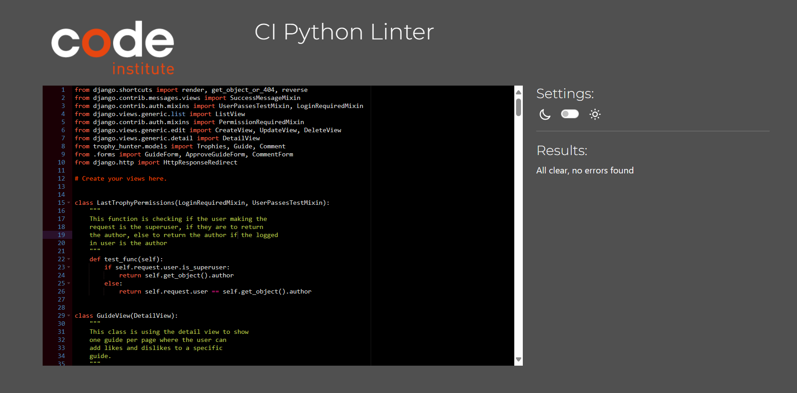

# Testing

Welcome to testing results of full stack application known as Last Trophy in this document you will find all the testing resuts such as solved bugs, how they were fixed any known bugs, manual and automated testing as well and how they were tested making sure each element worked as intended.

## CONTENTS

- [Testing](#testing)
- [HTML Validation](#html-validation)
- [Python Validation](#python-validation)
    - [Trophy Hunter](#trophy-hunter)
    - [Category](#category)
    - [Guides](#guides)
- [Solved Bugs](#solved-bugs)
- [Known Bugs](#known-bugs)
- [Lighthouse Testing](#lighthouse-testing)
    - [Mobile lighthouse testing](#mobile-lighthouse-testing)
    - [Desktop lighthouse testing](#desktop-lighthouse-testing)
- [Wave Report](#wave-report)
- [Manual Testing](#manual-testing)
    - [Aims](#aims)
    - [Testing Steps](#testing-steps)
    - [Testing Results](#testing-results)
- [Automated Testing](#automated-testing)
    - [Aims](#automated-testing-aims)
    - [Testing Logic](#testing-logic)
    - [Testing Results](#automated-testing-results)

## Testing Content 

### HTML Validation

`Index`

`Index Logged in`

`Game`

`Game Detail`

`Add Game`

`Edit Game`

`Delete Game`

`Add Trophy`

`Edit Trophy`

`Delete Trophy`

`Create Guide`

`Approve Guide`

`Guides not approved`

`Edit Guide`

`Delete Guide`

`Guide List`

`Add Comment`

`Edit Comment`

`Delete Comment`

`Comment List`

`Login`

`Sign Up`

### Python Validation

#### Trophy Hunter

`View`

`urls`

`Models`

`Form`

#### Category 

`View`

`urls`

`Form`

#### Guides

`View`

`urls`

`Form`

### CSS Validation 

### Solved Bugs

- Fixed function attribute error by going back into the trophy model and adjusting some key values such as the related name component and the trophy field name on the game model.
- Fixed an error where the trophies were not appearing, after completing the migrations for the model changes this fixed this issue.
- Fixed Slug field error by renaming the slug field to include a slug field and not a char field which fixed this issue.
- Fixed view error by first seperating the category and genre model into the trophy hunter app, I did this so I could reference the game model to link the game to the category. After this in the category view I imported the trophy hunter model and in particular the categories model so I could reference the model and then created the view. There was an issue with the url to fix this I added the url to the project and created the url within the category app which fixed the view error.
- Fixed migrations database model bugs where a field already existed to fix this I deleted the existing migrations and created the database model again.
- Fixed database already exists error by deleting all database models and creating them again starting with the genre model as when trying to delete the game orginally this would clash with the genre model not allowing me to create or add new migrations to the database model. Deleting and creating the models and the model structure again fixed this issue.
- Fixed slug errors by adjusting spelling mistakes to make sure the correct slug was being loaded.
- Fixed a bug where the games were not being seperated into different genres to fix this I created a form and used a table to allow the user to specify which genre, game title or trophy count they were looking for. Once this was done I was able to use the slug url to then allow the user to click on the game title, which takes the user to the game details, such as the trophies and where the written guides will be. The creation of the genre form fixed these errors.
- Had many errors when trying to link the guides to the game model, at first doing this showcased this under every trophy which was not the intended behaviour, to fix this I first added a slug field to the trophy model and then created a slug for all the trophies. After this I created a new app called guides and created a new view, new urls and a new template called guide_detail. Doing this allowed me to access the trophy slug url and link this to the trophy title, which showcased the correct guides under the correct trophies which fixed the guides errors.
- Fixed Warning errors for all urls that had a slash before the pathway removing the slash removed this warning.
- Fixed front end guide bugs originally when I was trying to use the create view class, this did not work as the slug could not be found. I tried to make a new function with a request and recieving the guide id. This did not work as the fields were appearing as being null, in order to fix this I went back to the create view solution and changed the spelling from trophies to trophy which targeted the right slug and fixed this issue.
- Fixed an error where the trophy  needed to be selected, to fix this I added a function called form valid, which would get the value of the primary key of the trophy I had clicked on, which set the trophy title to the one I clicked on which fixed this issue.
- Fixed redirect error originally the create guide view was redirecting the user to the game form, which wasnt a good user experience (UX). To fix this I created a new function called get success url, and then used the function name to get the url and dot notation to get the trophy model and its slug. Which redirected the user to the page they were visiting which fixed this error.
- Fixed update view error when I was trying to edit the current guide again the url was trying to access the same pathway. To fix this I changed the form pk from the trophy pk to the guide pk which fixed this issue.
- Fixed an error where the styling for the guide form was not stying with bootstrap or css. To fix this I went back to the forms.py file for the guide form, created a widgets dictionary for all the form fields. I also used the class form-control which loaded the bootstrap styling for the form fixing this issue.
- Fixed guide if statement by starting the if statement before the for loop, before this the intended behavoiour was not working placing the if statement before the for loop and placing the for loop inside the if statement as part of the else condition fixed this error.
- Fixed create guide bugs, the user could click create guide without being signed in with an error appearing stating no user defined. In order to fix this I added two if statements to first determine if there were any guides created, if there were the first if statement checked if there were no guides and the user was not logged in, if that was the case a login below button appeared for the user to log in. To make sure the user could not login twice I changed the login button to a create guide button to make sure the user could not login twice. After this the button and text would change asking the user to create a guide if there were no guides created.
- Fixed the last create guide error, the error orginally occured when there were guides created and the user was not logged in. To fix this I created another if statement which checked if there were guides created and if the user was not logged in to login. Otherwise the user can create a guide which fixed these erorrs.
- Fixed python structure bugs by changing how many characters a specific line of code was, adding extra space and removing empty white lines etc which fixed these errors.
- Fixed 500 error which was not displaying correctly because  there were to many arguments in the function, to fix this I removed the exception argument which fixed this issue.
- Fixed create view error when trying to use user permission mixin. The logic I was using was trying to get the author of the guide and match that with the logged in user, when there wasn't one. To fix this I added the login required mixin which redirected the user to the login page, once logged in the users was  then able to create a guide.
- Fixed guide bugs I was unable to reference the specific trophy in the guide view, to fix this I changed the trophy.title to trophies which referenced the spelling in the view which loaded the specific trophy to the web page.
- Fixed user authentication create game error, orginally the create game button would not appear regardless of which user was logged in. In order to fix this I added an if statement making sure the user was the superuser user which checked if the logged in user was the super user, if they are the button would show allowing the admin user to create a game in the front end.
- Fixed approving guide bugs orginally the guides awaiting approval were not being shown. To fix this I created a new template and a new view to sort the guides awaiting apporval as approved equals false. I displayed this in a list view. To then approve the guides I created a new form which used the approved field where the admin user can tick this box to approve the guide which is then added to the trophy fixing this issue.
- Fixed Guide model does not have the guide attribute. Orginally I was trying to access the guides primary key in the success url and the guide attribute did not exist, in order to fix this I changed the success url to the url not approved guides. Which returned the admin user to the unapproved guides page fixing this issue.
- Fixed Likes error when the user was not logged in, this would return a status code. To fix this I added an if statement to the view checking if the user was logged in, if they were logged in this would add a like if the user was not logged in the user would be returned to the login page asking the user to login which fixed this issue.
- Fixed Likes bug by seperating the guide view into another view orginally I was targeting the trophy model which would not let show the specific likes for that guide, to fix this I created a new view using the detail view of that specific guide. To see all the information regarding this guide, such as leaving likes and comments. I did this by using the get context data method overriding the default behaviour of the detail view to show more content in this view which fixed this issue.
- Fixed comment error, originally the comments were being shown under every guide of that specific trophy, to fix this I removed the field trophy from the comment model. After this I then targeted the comment by using dot notation to find the comment model. If there was not a comment created the user could create a comment. By using dot notation to find the comment model and removing the trophy field section from the comment model fixed this issue.
- Fixed Admin Guide deletion error. Orginally one of the user stories was to allow the admin user to delete guides on the front end if they needed to. Originally this didnt work with the test function I was using. In order to fix this I added an if statement checking if the admin user was making the request, if they were to return the objects author allowing the admin user to access this view. To make sure I also allowed the orginal guide user to still delete there own guides, I added an else statement to return this view if the author was making this request which fixed these issues.
- Fixed placeholder trophy issue orginally, when the admin user created a trophy from the frontend the placeholder image would not display correctly along with the edit and delete buttons. The only way to then delete this trophy was from the backend, to try and fix this I tried to make the image field mandatory, so an image had to be submitted along with trying to change the image path none of this worked. During testing I noticed after the else statement I missed the end if so the if statement was never ending. To fix this I added the end if below the else behaviour which fixed this issue.
- Fixed scroll effect on the games detail page. The user was able to on all devices scroll to the right hiding certain content and seeing the edge of the page. To fix this I removed the class row from the div element which fixed this issue.
- Fixed sign up html errors by instead of using the template form as p I created the form element myself and made the required changes as I was unable to fix these errors by using the form as p changing this fixed these errors.
- Fixed Game input and select bugs they were not displaying correctly on different screen sizes. To fix this I added a border for both input and select variables which fixed this issue.
- Fixed pagination game guide warning, orginally this was not specificing a specific order in the object list. To fix this I added a class meta tag which would order the guides in ascending order of when they were created showing the oldest guides at the top of the page.
- Fixed Trophy slug bug orginally the trophy slug had a default value and did not have a unique requirement if the admin user created two trophies with the same slug the application would crash to fix this I removed the default field and added a unique = true requirement to the trophy model which detected if there was another slug with the same name which fixed this issue.

### Known Bugs

* When Approving a guide on the front end the success message does not load in the guides not approved list. I have tried adding the messages logic into the approved guides template instead which did not work. I have tried using the messages framework but there was difficulty reworking the view from a class based view ultimately I was unable to fix this at the moment.

### Lighthouse Testing

#### Mobile Lighthouse Testing

`Home`

`Game`

`Game-detail`

`Trophy-detail`

`Guide-detail`

#### Desktop Lighthouse Testing

`Home`

`Game`

`Game-detail`

`Trophy-detail`

`Guide-detail`

### Wave Report

* This section shows all the wave validation results sign up, login, admin features could not be tested during this.

`Index`

`Game`

`Game-Detail`

`Trophy-Detail`

### Manual Testing

#### Aims

* The aim of testing is to make sure all elements work as intended without any console or server errors on the front end or the back end, make sure this application is responsive on all screen sizes.

* This will be done by allowing the user to login, logout, register create, edit and delete there own comments and guides. The user will be able to click on each trophy leading to the information regarding this trophy such as any guides that have been created.

* Make sure created error pages are shown rather than generic django errors.

* When the user tries to view content via a url make sure the user is redirected to a login page making sure the user has the permissions for this.

### Testing Steps 

* I will test the responsiveness for all screen sizes by firstly clicking on the application and using the inspect tool to open the google chrome developer tools.
* After this I will click on the laptop display and change the aspect ration to 280px which is the lowest screen size, after this I will begin adjusting the screen sizes to make sure all elements are displaying correctly on all screen sizes.
* I will make sure all trophies go to the correct trophy and none are duplicated, if a user is logged in they can create guides, if they are the guide author they can edit and delete this guide otherwise redirect the user.
* I will make sure all links open in seperate tabs not taking the user from the pain page.
* I will make sure the created error pages are shown rather than django generic errors. 
* All testing will be completed using Google Chrome, Internet Explorer.

### Testing Results

`Responsive Tests`

**Responsiveness**|**Index page**|**Category page**|**Games page**|**Trophies page**|**Guides page**|**Login page**|**Register page**|**Create Form**|**Edit Form**|**Delete Page**|**Approval page**
:-----:|:-----:|:-----:|:-----:|:-----:|:-----:|:-----:|:-----:|:-----:|:-----:|:-----:|:-----:
Page Heading text|Pass|N/A|N/A|N/A|N/A|N/A|N/A|N/A|N/A|N/A|N/A
Navigation Bar|Pass|Pass|Pass|Pass|Pass|Pass|Pass|Pass|Pass|Pass|Pass
Genre Form|N/A|N/A|Pass|N/A|N/A|N/A|N/A|N/A|N/A|N/A|N/A
Game Details|N/A|N/A|Pass|N/A|N/A|N/A|N/A|N/A|N/A|N/A|N/A
Trophy Details|N/A|N/A|Pass|Pass|Pass|N/A|N/A|N/A|N/A|N/A|N/A
Add Game form|N/A|N/A|N/A|N/A|N/A|N/A|N/A|Pass|N/A|N/A|N/A
Edit Game form|N/A|N/A|N/A|N/A|N/A|N/A|N/A|N/A|Pass|N/A|N/A
Delete Game|N/A|N/A|N/A|N/A|N/A|N/A|N/A|N/A|N/A|Pass|N/A
Add Trophies form|N/A|N/A|N/A|N/A|N/A|N/A|N/A|Pass|N/A|N/A|N/A
Edit Trophies form|N/A|N/A|N/A|N/A|N/A|N/A|N/A|N/A|Pass|N/A|N/A
Delete Trophy|N/A|N/A|N/A|N/A|N/A|N/A|N/A|N/A|N/A|Pass|N/A
Guides|N/A|N/A|N/A|N/A|Pass|N/A|N/A|N/A|N/A|N/A|Pass
Likes|N/A|N/A|N/A|N/A|Pass|N/A|N/A|N/A|N/A|N/A|N/A
Dislikes|N/A|N/A|N/A|N/A|Pass|N/A|N/A|N/A|N/A|N/A|N/A
Create Guide|N/A|N/A|N/A|N/A|N/A|N/A|N/A|Pass|N/A|N/A|N/A
Edit Guide |N/A|N/A|N/A|N/A|N/A|N/A|N/A|N/A|Pass|N/A|N/A
Delete Guide|N/A|N/A|N/A|N/A|N/A|N/A|N/A|N/A|N/A|Pass|N/A
Comments|N/A|N/A|N/A|N/A|Pass|N/A|N/A|N/A|N/A|N/A|Pass
Create Comment|N/A|N/A|N/A|N/A|N/A|N/A|N/A|Pass|N/A|N/A|N/A
Edit Comment|N/A|N/A|N/A|N/A|N/A|N/A|N/A|N/A|Pass|N/A|N/A
Delete Comment|N/A|N/A|N/A|N/A|N/A|N/A|N/A|N/A|N/A|Pass|N/A
Guide Approval|N/A|N/A|N/A|N/A|N/A|N/A|N/A|N/A|N/A|N/A|Pass
Comment Approval|N/A|N/A|N/A|N/A|N/A|N/A|N/A|N/A|N/A|N/A|Pass

`Celeste Game`

**Element**|**Expected Outcome**|**Testing Performed**|**Result**|**Pass/Fail**
:-----:|:-----:|:-----:|:-----:|:-----:
Forsaken Trophy|Load Trophy detail when clicked|Clicked Trophy Title|Trophy Detail loaded|Pass
Gateway Trophy|Load Trophy detail when clicked|Clicked Trophy Title|Trophy Detail loaded|Pass
Archaeology Trophy|Load Trophy detail when clicked|Clicked Trophy Title|Trophy Detail loaded|Pass
Checking Out Trophy|Load Trophy detail when clicked|Clicked Trophy Title|Trophy Detail loaded|Pass
Strawberry Badge Trophy|Load Trophy detail when clicked|Clicked Trophy Title|Trophy Detail loaded|Pass
Breathe Trophy|Load Trophy detail when clicked|Clicked Trophy Title|Trophy Detail loaded|Pass
In the Mirror Trophy|Load Trophy detail when clicked|Clicked Trophy Title|Trophy Detail loaded|Pass
Reflection Trophy|Load Trophy detail when clicked|Clicked Trophy Title|Trophy Detail loaded|Pass
Celeste Trophy|Load Trophy detail when clicked|Clicked Trophy Title|Trophy Detail loaded|Pass
Pointless Machines Trophy|Load Trophy detail when clicked|Clicked Trophy Title|Trophy Detail loaded|Pass
Strawberry Medal Trophy|Load Trophy detail when clicked|Clicked Trophy Title|Trophy Detail loaded|Pass
Resurrections Trophy|Load Trophy detail when clicked|Clicked Trophy Title|Trophy Detail loaded|Pass
Eye of the Storm Trophy|Load Trophy detail when clicked|Clicked Trophy Title|Trophy Detail loaded|Pass
Scattered and Lost Trophy|Load Trophy detail when clicked|Clicked Trophy Title|Trophy Detail loaded|Pass
Black Moonrise Trophy|Load Trophy detail when clicked|Clicked Trophy Title|Trophy Detail loaded|Pass
Sever the Skyline Trophy|Load Trophy detail when clicked|Clicked Trophy Title|Trophy Detail loaded|Pass
Real Gamer Trophy|Load Trophy detail when clicked|Clicked Trophy Title|Trophy Detail loaded|Pass
Heart of the Mountain Trophy|Load Trophy detail when clicked|Clicked Trophy Title|Trophy Detail loaded|Pass
Heavy and Frail Trophy|Load Trophy detail when clicked|Clicked Trophy Title|Trophy Detail loaded|Pass
Good Karma Trophy|Load Trophy detail when clicked|Clicked Trophy Title|Trophy Detail loaded|Pass
Quiet and Falling Trophy|Load Trophy detail when clicked|Clicked Trophy Title|Trophy Detail loaded|Pass
Golden Feather Trophy|Load Trophy detail when clicked|Clicked Trophy Title|Trophy Detail loaded|Pass
Pink Sunrise Trophy|Load Trophy detail when clicked|Clicked Trophy Title|Trophy Detail loaded|Pass
Mirror Magic Trophy|Load Trophy detail when clicked|Clicked Trophy Title|Trophy Detail loaded|Pass
Center of the Earth Trophy|Load Trophy detail when clicked|Clicked Trophy Title|Trophy Detail loaded|Pass
No More Running Trophy|Load Trophy detail when clicked|Clicked Trophy Title|Trophy Detail loaded|Pass
Say Goodbye Trophy|Load Trophy detail when clicked|Clicked Trophy Title|Trophy Detail loaded|Pass
Impress Your Friends Trophy|Load Trophy detail when clicked|Clicked Trophy Title|Trophy Detail loaded|Pass
1UP Trophy|Load Trophy detail when clicked|Clicked Trophy Title|Trophy Detail loaded|Pass
Thanks For Playing Trophy|Load Trophy detail when clicked|Clicked Trophy Title|Trophy Detail loaded|Pass
Heartbeat|Load Trophy detail when clicked|Clicked Trophy Title|Trophy Detail loaded|Pass

`Alien Isolation Game`

**Element**|**Expected Outcome**|**Testing Performed**|**Result**|**Pass/Fail**
:-----:|:-----:|:-----:|:-----:|:-----:
A Record of Disaster|Load Trophy when clicked|Clicked Trophy Title|Trophy Detail loaded|Pass
Awake|Load Trophy when clicked|Clicked Trophy Title|Trophy Detail loaded|Pass
The Missing|Load Trophy when clicked|Clicked Trophy Title|Trophy Detail loaded|Pass
Build to Survive|Load Trophy when clicked|Clicked Trophy Title|Trophy Detail loaded|Pass
Welcome to Sevastopol|Load Trophy when clicked|Clicked Trophy Title|Trophy Detail loaded|Pass
A Perfect Organism|Load Trophy when clicked|Clicked Trophy Title|Trophy Detail loaded|Pass
A Hunt Begins|Load Trophy when clicked|Clicked Trophy Title|Trophy Detail loaded|Pass
Every Bullet Counts|Load Trophy when clicked|Clicked Trophy Title|Trophy Detail loaded|Pass
She's in the Vents...|Load Trophy when clicked|Clicked Trophy Title|Trophy Detail loaded|Pass
Fault Detected|Load Trophy when clicked|Clicked Trophy Title|Trophy Detail loaded|Pass
Not a Scratch|Load Trophy when clicked|Clicked Trophy Title|Trophy Detail loaded|Pass
You Shouldn't Be There|Load Trophy when clicked|Clicked Trophy Title|Trophy Detail loaded|Pass
Light 'em Up|Load Trophy when clicked|Clicked Trophy Title|Trophy Detail loaded|Pass
Power Games|Load Trophy when clicked|Clicked Trophy Title|Trophy Detail loaded|Pass
How Do You Feel?|Load Trophy when clicked|Clicked Trophy Title|Trophy Detail loaded|Pass
Back Off|Load Trophy when clicked|Clicked Trophy Title|Trophy Detail loaded|Pass
Stunned|Load Trophy when clicked|Clicked Trophy Title|Trophy Detail loaded|Pass
Shock to the System|Load Trophy when clicked|Clicked Trophy Title|Trophy Detail loaded|Pass
Caught in the Trap|Load Trophy when clicked|Clicked Trophy Title|Trophy Detail loaded|Pass
I Admire its Purity|Load Trophy when clicked|Clicked Trophy Title|Trophy Detail loaded|Pass
Seegson Security Bypass|Load Trophy when clicked|Clicked Trophy Title|Trophy Detail loaded|Pass
An Outpost of Progress|Load Trophy when clicked|Clicked Trophy Title|Trophy Detail loaded|Pass
Not the First|Load Trophy when clicked|Clicked Trophy Title|Trophy Detail loaded|Pass
Self Defense|Load Trophy when clicked|Clicked Trophy Title|Trophy Detail loaded|Pass
Use With Caution...|Load Trophy when clicked|Clicked Trophy Title|Trophy Detail loaded|Pass
Bait|Load Trophy when clicked|Clicked Trophy Title|Trophy Detail loaded|Pass
Hazard Containment|Load Trophy when clicked|Clicked Trophy Title|Trophy Detail loaded|Pass
A Synthetic Solution|Load Trophy when clicked|Clicked Trophy Title|Trophy Detail loaded|Pass
Consultation|Load Trophy when clicked|Clicked Trophy Title|Trophy Detail loaded|Pass
This Should Work|Load Trophy when clicked|Clicked Trophy Title|Trophy Detail loaded|Pass
Seegson Systems Expert|Load Trophy when clicked|Clicked Trophy Title|Trophy Detail loaded|Pass
Throwing the Switch|Load Trophy when clicked|Clicked Trophy Title|Trophy Detail loaded|Pass
The Message|Load Trophy when clicked|Clicked Trophy Title|Trophy Detail loaded|Pass
Transmission|Load Trophy when clicked|Clicked Trophy Title|Trophy Detail loaded|Pass
Free the Torrens|Load Trophy when clicked|Clicked Trophy Title|Trophy Detail loaded|Pass
Ripley, Signing Off|Load Trophy when clicked|Clicked Trophy Title|Trophy Detail loaded|Pass
End of the Hunt|Load Trophy when clicked|Clicked Trophy Title|Trophy Detail loaded|Pass
A True Engineer|Load Trophy when clicked|Clicked Trophy Title|Trophy Detail loaded|Pass
Voices of Sevastopol|Load Trophy when clicked|Clicked Trophy Title|Trophy Detail loaded|Pass
Retreat From Fire|Load Trophy when clicked|Clicked Trophy Title|Trophy Detail loaded|Pass
My Turn Now|Load Trophy when clicked|Clicked Trophy Title|Trophy Detail loaded|Pass
Hide. Run. Survive.|Load Trophy when clicked|Clicked Trophy Title|Trophy Detail loaded|Pass
Just out of Reach|Load Trophy when clicked|Clicked Trophy Title|Trophy Detail loaded|Pass
100 Times Too Many|Load Trophy when clicked|Clicked Trophy Title|Trophy Detail loaded|Pass
Survivor|Load Trophy when clicked|Clicked Trophy Title|Trophy Detail loaded|Pass
Mind Your Step|Load Trophy when clicked|Clicked Trophy Title|Trophy Detail loaded|Pass
Mercy or Prudence?|Load Trophy when clicked|Clicked Trophy Title|Trophy Detail loaded|Pass
Archivist|Load Trophy when clicked|Clicked Trophy Title|Trophy Detail loaded|Pass
The Taken|Load Trophy when clicked|Clicked Trophy Title|Trophy Detail loaded|Pass
One Shot|Load Trophy when clicked|Clicked Trophy Title|Trophy Detail loaded|Pass
Alien: Isolation|Load Trophy when clicked|Clicked Trophy Title|Trophy Detail loaded|Pass

`Resident Evil 7 Biohazard Game`

**Element**|**Expected Outcome**|**Testing Performed**|**Result**|**Pass/Fail**
:-----:|:-----:|:-----:|:-----:|:-----:
She's Alive|Load Trophy when clicked|Clicked Trophy Title|Trophy Detail loaded|Pass
A-ha!|Load Trophy when clicked|Clicked Trophy Title|Trophy Detail loaded|Pass
Behind Closed Doors|Load Trophy when clicked|Clicked Trophy Title|Trophy Detail loaded|Pass
Welcome to the Family, Son|Load Trophy when clicked|Clicked Trophy Title|Trophy Detail loaded|Pass
Master of Unlocking|Load Trophy when clicked|Clicked Trophy Title|Trophy Detail loaded|Pass
He's Here, There, Everywhere!|Load Trophy when clicked|Clicked Trophy Title|Trophy Detail loaded|Pass
Into the Depths|Load Trophy when clicked|Clicked Trophy Title|Trophy Detail loaded|Pass
Can't Catch Me|Load Trophy when clicked|Clicked Trophy Title|Trophy Detail loaded|Pass
Nice Try|Load Trophy when clicked|Clicked Trophy Title|Trophy Detail loaded|Pass
Things Got Personal|Load Trophy when clicked|Clicked Trophy Title|Trophy Detail loaded|Pass
Open Your Eyes|Load Trophy when clicked|Clicked Trophy Title|Trophy Detail loaded|Pass
You Ain't Gettin' Away|Load Trophy when clicked|Clicked Trophy Title|Trophy Detail loaded|Pass
In the Bag|Load Trophy when clicked|Clicked Trophy Title|Trophy Detail loaded|Pass
The Grave Will Out the Truth|Load Trophy when clicked|Clicked Trophy Title|Trophy Detail loaded|Pass
You Better Start Running|Load Trophy when clicked|Clicked Trophy Title|Trophy Detail loaded|Pass
Less is More|Load Trophy when clicked|Clicked Trophy Title|Trophy Detail loaded|Pass
Playing ir Safe|Load Trophy when clicked|Clicked Trophy Title|Trophy Detail loaded|Pass
Be Kind, Please Rewind|Load Trophy when clicked|Clicked Trophy Title|Trophy Detail loaded|Pass
End of the Night|Load Trophy when clicked|Clicked Trophy Title|Trophy Detail loaded|Pass
The Nightmare's Finally Over|Load Trophy when clicked|Clicked Trophy Title|Trophy Detail loaded|Pass
Slash Slash, Slashity Slash!|Load Trophy when clicked|Clicked Trophy Title|Trophy Detail loaded|Pass
Back Off, Mrs. B!|Load Trophy when clicked|Clicked Trophy Title|Trophy Detail loaded|Pass
Fly Swatter|Load Trophy when clicked|Clicked Trophy Title|Trophy Detail loaded|Pass
Just A Memory Now|Load Trophy when clicked|Clicked Trophy Title|Trophy Detail loaded|Pass
Duck If You Love Life|Load Trophy when clicked|Clicked Trophy Title|Trophy Detail loaded|Pass
1st Place at the Science Fair|Load Trophy when clicked|Clicked Trophy Title|Trophy Detail loaded|Pass
That's a Spicy Meta-a-ball|Load Trophy when clicked|Clicked Trophy Title|Trophy Detail loaded|Pass
Just Get Me Outta Here|Load Trophy when clicked|Clicked Trophy Title|Trophy Detail loaded|Pass
Mr. Nowhere|Load Trophy when clicked|Clicked Trophy Title|Trophy Detail loaded|Pass
Out Before Dessert|Load Trophy when clicked|Clicked Trophy Title|Trophy Detail loaded|Pass
The Devil Is in the Details|Load Trophy when clicked|Clicked Trophy Title|Trophy Detail loaded|Pass
Who's Your Daddy Now?|Load Trophy when clicked|Clicked Trophy Title|Trophy Detail loaded|Pass
Pelicans in Your Pocket|Load Trophy when clicked|Clicked Trophy Title|Trophy Detail loaded|Pass
Walk it Off|Load Trophy when clicked|Clicked Trophy Title|Trophy Detail loaded|Pass
Resource Manager|Load Trophy when clicked|Clicked Trophy Title|Trophy Detail loaded|Pass
Mad Pelicans|Load Trophy when clicked|Clicked Trophy Title|Trophy Detail loaded|Pass
Biosplattered|Load Trophy when clicked|Clicked Trophy Title|Trophy Detail loaded|Pass

`Elden Ring Game`

**Element**|**Expected Outcome**|**Testing Performed**|**Result**|**Pass/Fail**
:-----:|:-----:|:-----:|:-----:|:-----:
Roundtable Hold|Load Trophy when clicked|Clicked Trophy Title|Trophy Detail loaded|Pass
Margit, The Fell Omen|Load Trophy when clicked|Clicked Trophy Title|Trophy Detail loaded|Pass
Erdtree Aflame|Load Trophy when clicked|Clicked Trophy Title|Trophy Detail loaded|Pass
Shardbearer Godrick|Load Trophy when clicked|Clicked Trophy Title|Trophy Detail loaded|Pass
Magma Wyrm Makar|Load Trophy when clicked|Clicked Trophy Title|Trophy Detail loaded|Pass
Great Rune|Load Trophy when clicked|Clicked Trophy Title|Trophy Detail loaded|Pass
Red Wolf of Radagon|Load Trophy when clicked|Clicked Trophy Title|Trophy Detail loaded|Pass
Leonie Misbegotten|Load Trophy when clicked|Clicked Trophy Title|Trophy Detail loaded|Pass
Rennala, Queen of the Full Moon|Load Trophy when clicked|Clicked Trophy Title|Trophy Detail loaded|Pass
Royal Knight Loretta|Load Trophy when clicked|Clicked Trophy Title|Trophy Detail loaded|Pass
Shardbearer Radahn|Load Trophy when clicked|Clicked Trophy Title|Trophy Detail loaded|Pass
Mimic Tear|Load Trophy when clicked|Clicked Trophy Title|Trophy Detail loaded|Pass
Godfrey the First Elden Lord|Load Trophy when clicked|Clicked Trophy Title|Trophy Detail loaded|Pass
Shardbearer Morgott|Load Trophy when clicked|Clicked Trophy Title|Trophy Detail loaded|Pass
Fire Giant|Load Trophy when clicked|Clicked Trophy Title|Trophy Detail loaded|Pass
God-Slaying Armament|Load Trophy when clicked|Clicked Trophy Title|Trophy Detail loaded|Pass
Commander Niall|Load Trophy when clicked|Clicked Trophy Title|Trophy Detail loaded|Pass
Shardbearer Rykard|Load Trophy when clicked|Clicked Trophy Title|Trophy Detail loaded|Pass
Astel, Naturalborn of the Void|Load Trophy when clicked|Clicked Trophy Title|Trophy Detail loaded|Pass
Godskin Duo|Load Trophy when clicked|Clicked Trophy Title|Trophy Detail loaded|Pass
Godskin Noble|Load Trophy when clicked|Clicked Trophy Title|Trophy Detail loaded|Pass
Ancestor Spirit|Load Trophy when clicked|Clicked Trophy Title|Trophy Detail loaded|Pass
Maliketh the Black Blade|Load Trophy when clicked|Clicked Trophy Title|Trophy Detail loaded|Pass
Elemer of the Briar|Load Trophy when clicked|Clicked Trophy Title|Trophy Detail loaded|Pass
Dragonkin Soldier of Nokstella|Load Trophy when clicked|Clicked Trophy Title|Trophy Detail loaded|Pass
Hoarah Loux, the warrior|Load Trophy when clicked|Clicked Trophy Title|Trophy Detail loaded|Pass
Valiant Gargoyles|Load Trophy when clicked|Clicked Trophy Title|Trophy Detail loaded|Pass
Loretta Knight of the Haligtree|Load Trophy when clicked|Clicked Trophy Title|Trophy Detail loaded|Pass
Shardbearer Mohg|Load Trophy when clicked|Clicked Trophy Title|Trophy Detail loaded|Pass
Regal Ancestor Spirit|Load Trophy when clicked|Clicked Trophy Title|Trophy Detail loaded|Pass
Shardbearer Malenia|Load Trophy when clicked|Clicked Trophy Title|Trophy Detail loaded|Pass
Mohg, the Omen|Load Trophy when clicked|Clicked Trophy Title|Trophy Detail loaded|Pass
Lichdragon Fortissax|Load Trophy when clicked|Clicked Trophy Title|Trophy Detail loaded|Pass
Dragonlord Placidusax|Load Trophy when clicked|Clicked Trophy Title|Trophy Detail loaded|Pass
Age of the Stars|Load Trophy when clicked|Clicked Trophy Title|Trophy Detail loaded|Pass
Elden Lord|Load Trophy when clicked|Clicked Trophy Title|Trophy Detail loaded|Pass
Legendary Ashen Remains|Load Trophy when clicked|Clicked Trophy Title|Trophy Detail loaded|Pass
Legendary Armaments|Load Trophy when clicked|Clicked Trophy Title|Trophy Detail loaded|Pass
Legendary Talismans|Load Trophy when clicked|Clicked Trophy Title|Trophy Detail loaded|Pass
Legendary Sorceries and Incantations|Load Trophy when clicked|Clicked Trophy Title|Trophy Detail loaded|Pass
Lord of Frenzied Flame|Load Trophy when clicked|Clicked Trophy Title|Trophy Detail loaded|Pass
Elden Ring|Load Trophy when clicked|Clicked Trophy Title|Trophy Detail loaded|Pass

`Tekken 8 Game`

**Element**|**Expected Outcome**|**Testing Performed**|**Result**|**Pass/Fail**
:-----:|:-----:|:-----:|:-----:|:-----:
What a rush!|Load Trophy when clicked|Clicked Trophy Title|Trophy Detail loaded|Pass
Let the blistering sands consume you|Load Trophy when clicked|Clicked Trophy Title|Trophy Detail loaded|Pass
Your fate is already decided|Load Trophy when clicked|Clicked Trophy Title|Trophy Detail loaded|Pass
That was too easy!|Load Trophy when clicked|Clicked Trophy Title|Trophy Detail loaded|Pass
Under the divine protection of the Sirius|Load Trophy when clicked|Clicked Trophy Title|Trophy Detail loaded|Pass
Behold, the fruits of my labors|Load Trophy when clicked|Clicked Trophy Title|Trophy Detail loaded|Pass
Fear my wrath|Load Trophy when clicked|Clicked Trophy Title|Trophy Detail loaded|Pass
Now it's time to destroy you|Load Trophy when clicked|Clicked Trophy Title|Trophy Detail loaded|Pass
Outstanding!|Load Trophy when clicked|Clicked Trophy Title|Trophy Detail loaded|Pass
You think you can stop me?|Load Trophy when clicked|Clicked Trophy Title|Trophy Detail loaded|Pass
Come, humanity! Unleash the dogs of war!|Load Trophy when clicked|Clicked Trophy Title|Trophy Detail loaded|Pass
No pain, no gain!|Load Trophy when clicked|Clicked Trophy Title|Trophy Detail loaded|Pass
You're in for it now!|Load Trophy when clicked|Clicked Trophy Title|Trophy Detail loaded|Pass
(That's how a true champion fights!)|Load Trophy when clicked|Clicked Trophy Title|Trophy Detail loaded|Pass
Your money is my money!|Load Trophy when clicked|Clicked Trophy Title|Trophy Detail loaded|Pass
(You never learn)|Load Trophy when clicked|Clicked Trophy Title|Trophy Detail loaded|Pass
You aren't alone anymore|Load Trophy when clicked|Clicked Trophy Title|Trophy Detail loaded|Pass
Sorry for getting rough back there|Load Trophy when clicked|Clicked Trophy Title|Trophy Detail loaded|Pass
...|Load Trophy when clicked|Clicked Trophy Title|Trophy Detail loaded|Pass
Excellent!|Load Trophy when clicked|Clicked Trophy Title|Trophy Detail loaded|Pass
I would do well to follow your example|Load Trophy when clicked|Clicked Trophy Title|Trophy Detail loaded|Pass
I'll live on, together with my sins|Load Trophy when clicked|Clicked Trophy Title|Trophy Detail loaded|Pass
Resuming mission|Load Trophy when clicked|Clicked Trophy Title|Trophy Detail loaded|Pass
I aspire to greater heights!|Load Trophy when clicked|Clicked Trophy Title|Trophy Detail loaded|Pass
Come on, just try and kill me|Load Trophy when clicked|Clicked Trophy Title|Trophy Detail loaded|Pass
Hope|Load Trophy when clicked|Clicked Trophy Title|Trophy Detail loaded|Pass
Just relax. You can do it|Load Trophy when clicked|Clicked Trophy Title|Trophy Detail loaded|Pass
Congrats on the victory!|Load Trophy when clicked|Clicked Trophy Title|Trophy Detail loaded|Pass
I'm actually pretty strong|Load Trophy when clicked|Clicked Trophy Title|Trophy Detail loaded|Pass
I'll put an end to this|Load Trophy when clicked|Clicked Trophy Title|Trophy Detail loaded|Pass
There's no way you can stop me|Load Trophy when clicked|Clicked Trophy Title|Trophy Detail loaded|Pass
How do you take your coffee?|Load Trophy when clicked|Clicked Trophy Title|Trophy Detail loaded|Pass
Do you want to learn Marshall Arts?|Load Trophy when clicked|Clicked Trophy Title|Trophy Detail loaded|Pass
I'll give you a rematch anytime, guv|Load Trophy when clicked|Clicked Trophy Title|Trophy Detail loaded|Pass
This should be fun|Load Trophy when clicked|Clicked Trophy Title|Trophy Detail loaded|Pass
A new star rising in the world of TEKKEN!|Load Trophy when clicked|Clicked Trophy Title|Trophy Detail loaded|Pass
The fists reveal the fighter|Load Trophy when clicked|Clicked Trophy Title|Trophy Detail loaded|Pass
(Initiating Analysis)|Load Trophy when clicked|Clicked Trophy Title|Trophy Detail loaded|Pass
Get ready for the next battle!|Load Trophy when clicked|Clicked Trophy Title|Trophy Detail loaded|Pass
Power isn't everything|Load Trophy when clicked|Clicked Trophy Title|Trophy Detail loaded|Pass
All is vanity|Load Trophy when clicked|Clicked Trophy Title|Trophy Detail loaded|Pass
(This one's in the bag!)|Load Trophy when clicked|Clicked Trophy Title|Trophy Detail loaded|Pass
Please don't tell my father|Load Trophy when clicked|Clicked Trophy Title|Trophy Detail loaded|Pass
Godfather|Load Trophy when clicked|Clicked Trophy Title|Trophy Detail loaded|Pass
My moves are way faster than yours|Load Trophy when clicked|Clicked Trophy Title|Trophy Detail loaded|Pass
Despair|Load Trophy when clicked|Clicked Trophy Title|Trophy Detail loaded|Pass
A fight is about survival|Load Trophy when clicked|Clicked Trophy Title|Trophy Detail loaded|Pass

`F1 23 Game`

**Element**|**Expected Outcome**|**Testing Performed**|**Result**|**Pass/Fail**
:-----:|:-----:|:-----:|:-----:|:-----:
Getting on the Step|Load Trophy when clicked|Clicked Trophy Title|Trophy Detail loaded|Pass
On the Top Step|Load Trophy when clicked|Clicked Trophy Title|Trophy Detail loaded|Pass
Setting up for Success|Load Trophy when clicked|Clicked Trophy Title|Trophy Detail loaded|Pass
Team Orders|Load Trophy when clicked|Clicked Trophy Title|Trophy Detail loaded|Pass
Familiar Faces|Load Trophy when clicked|Clicked Trophy Title|Trophy Detail loaded|Pass
Going the Extra Mile|Load Trophy when clicked|Clicked Trophy Title|Trophy Detail loaded|Pass
Engineer|Load Trophy when clicked|Clicked Trophy Title|Trophy Detail loaded|Pass
Sharing the Love|Load Trophy when clicked|Clicked Trophy Title|Trophy Detail loaded|Pass
Making History|Load Trophy when clicked|Clicked Trophy Title|Trophy Detail loaded|Pass
Hitting a season|Load Trophy when clicked|Clicked Trophy Title|Trophy Detail loaded|Pass
A Dozen Pieces|Load Trophy when clicked|Clicked Trophy Title|Trophy Detail loaded|Pass
Network Success|Load Trophy when clicked|Clicked Trophy Title|Trophy Detail loaded|Pass
Writing a new Chapter|Load Trophy when clicked|Clicked Trophy Title|Trophy Detail loaded|Pass
Challenge Yourself|Load Trophy when clicked|Clicked Trophy Title|Trophy Detail loaded|Pass
Spring Cleaning|Load Trophy when clicked|Clicked Trophy Title|Trophy Detail loaded|Pass
Proving Them Wrong|Load Trophy when clicked|Clicked Trophy Title|Trophy Detail loaded|Pass
Reduce|Load Trophy when clicked|Clicked Trophy Title|Trophy Detail loaded|Pass
Hitting a Bullseye|Load Trophy when clicked|Clicked Trophy Title|Trophy Detail loaded|Pass
Lighting Round the World|Load Trophy when clicked|Clicked Trophy Title|Trophy Detail loaded|Pass
Ups and Downs|Load Trophy when clicked|Clicked Trophy Title|Trophy Detail loaded|Pass
All in a Weekend's Work|Load Trophy when clicked|Clicked Trophy Title|Trophy Detail loaded|Pass
Reuse|Load Trophy when clicked|Clicked Trophy Title|Trophy Detail loaded|Pass
Oil and Water|Load Trophy when clicked|Clicked Trophy Title|Trophy Detail loaded|Pass
Crucial Combo|Load Trophy when clicked|Clicked Trophy Title|Trophy Detail loaded|Pass
Tinkerer|Load Trophy when clicked|Clicked Trophy Title|Trophy Detail loaded|Pass
Friendly Competition|Load Trophy when clicked|Clicked Trophy Title|Trophy Detail loaded|Pass
Gathering Dust|Load Trophy when clicked|Clicked Trophy Title|Trophy Detail loaded|Pass
Undisputed Winner |Load Trophy when clicked|Clicked Trophy Title|Trophy Detail loaded|Pass
Switcheroo|Load Trophy when clicked|Clicked Trophy Title|Trophy Detail loaded|Pass
Eagle Eye|Load Trophy when clicked|Clicked Trophy Title|Trophy Detail loaded|Pass
One for the Book|Load Trophy when clicked|Clicked Trophy Title|Trophy Detail loaded|Pass
Recycle|Load Trophy when clicked|Clicked Trophy Title|Trophy Detail loaded|Pass
For all Those Back at the Factory|Load Trophy when clicked|Clicked Trophy Title|Trophy Detail loaded|Pass
Spinning Around|Load Trophy when clicked|Clicked Trophy Title|Trophy Detail loaded|Pass
Peak Performance|Load Trophy when clicked|Clicked Trophy Title|Trophy Detail loaded|Pass
Smooth Operator|Load Trophy when clicked|Clicked Trophy Title|Trophy Detail loaded|Pass
Loyal Bond|Load Trophy when clicked|Clicked Trophy Title|Trophy Detail loaded|Pass
Living up to Expectations|Load Trophy when clicked|Clicked Trophy Title|Trophy Detail loaded|Pass
Hitting a Century|Load Trophy when clicked|Clicked Trophy Title|Trophy Detail loaded|Pass
Wait, I know you?|Load Trophy when clicked|Clicked Trophy Title|Trophy Detail loaded|Pass
Seasoned Rookie|Load Trophy when clicked|Clicked Trophy Title|Trophy Detail loaded|Pass
Under the Microscope|Load Trophy when clicked|Clicked Trophy Title|Trophy Detail loaded|Pass
Filling in the Gaps|Load Trophy when clicked|Clicked Trophy Title|Trophy Detail loaded|Pass
Media Darling|Load Trophy when clicked|Clicked Trophy Title|Trophy Detail loaded|Pass
Saturday Night Drama|Load Trophy when clicked|Clicked Trophy Title|Trophy Detail loaded|Pass
Ultimate Collector|Load Trophy when clicked|Clicked Trophy Title|Trophy Detail loaded|Pass
Shot in the Dark|Load Trophy when clicked|Clicked Trophy Title|Trophy Detail loaded|Pass
Golden Touch|Load Trophy when clicked|Clicked Trophy Title|Trophy Detail loaded|Pass
Elite Racer|Load Trophy when clicked|Clicked Trophy Title|Trophy Detail loaded|Pass
Racing Legend|Load Trophy when clicked|Clicked Trophy Title|Trophy Detail loaded|Pass

`Game Testing`

**Element**|**Expected Outcome**|**Testing Peformed**|**Result**|**Pass/Fail**
:-----:|:-----:|:-----:|:-----:|:-----:
Create Game (admin)|Create game button to appear when clicked create game form appears|Logged in as admin user |Create Game button appeared when clicked create game form loaded|Pass
Create Game(other user)|Create game button to be hidden|Logged in as a different user|Create Game button hidden|Pass
Create Game (via url user not logged in)|Redirect user to login page if incorrect user load 403 error page|Tried to access create game via url logged in as user matth|Redirect to login page appeared once logged in error 403 page appeared|Pass
Create Game (via url user logged in)|Redirect user to 403 error page if not admin user|Tried to access create game via url user already logged in|Redirect user to error 403 page stating incorrect permissions|Pass
Create Game (via url admin)|Load Create Game form|Tried to access create game via url as admin|Loaded Create Game form|Pass
Edit Game (admin)|Edit game button to appear when clicked edit game form appears|Logged in as admin user |Edit game button appeared when clicked edit game form loaded|Pass
Edit Game(other user)|Edit game button to be hidden|Logged in as a different user|Edit Game button hidden|Pass
Edit Game (via url user not logged in)|Redirect user to login page if incorrect user load 403 error page|Tried to access edit game via url logged in as user matth|Redirect to login page appeared once logged in error 403 page appeared|Pass
Edit Game (via url user logged in)|Redirect user to 403 error page if not admin user|Tried to access edit game via url user already logged in|Redirect user to error 403 page stating incorrect permissions|Pass
Edit Game (via url admin)|Load Edit Game form|Tried to access edit game via url as admin|Loaded Edit Game form|Pass
Delete Game (admin)|Delete game button to appear when clicked delete game page appears|Logged in as admin user |Delete game button appeared when clicked delete game screen loaded|Pass
Delete Game(other user)|Delete game button to be hidden|Logged in as a different user|Delete Game button hidden|Pass
Delete Game (via url user not logged in)|Redirect user to login page if incorrect user load 403 error page|Tried to access delete game via url logged in as user matth|Redirect to login page appeared once logged in error 403 page appeared|Pass
Delete Game (via url user logged in)|Redirect user to 403 error page if not admin user|Tried to access delete game via url user already logged in|Redirect user to error 403 page stating incorrect permissions|Pass
Delete Game (via url admin)|Load Delete Game form|Tried to delete  game via url as admin|Loaded Delete Game page|Pass

`Trophies Testing`

**Element**|**Expected Outcome**|**Testing Peformed**|**Result**|**Pass/Fail**
:-----:|:-----:|:-----:|:-----:|:-----:
Create Trophy (admin)|Create trophy button to appear when clicked create trophy form appears|Logged in as admin user |Create Trophy button appeared when clicked create trophy form loaded|Pass
Create Trophy(other user)|Create trophy button to be hidden|Logged in as a different user|Create Trophy button hidden|Pass
Create Trophy (via url user not logged in) |Redirect user to login page if incorrect user load 403 error page|Tried to access create trophy via url logged in as user matth|Redirect to login page appeared once logged in error 403 page appeared|Pass
Create Trophy (via url user logged in)|Redirect user to 403 error page if not admin user|Tried to access create trophy via url user already logged in|Redirect user to error 403 page stating incorrect permissions|Pass
Create Trophy (via url admin)|Load Create Trophy form|Tried to access create trophy via url as admin|Loaded Create Trophy form|Pass
Edit Trophy(admin)|Edit trophy button to appear when clicked edit trophy form appears|Logged in as admin user |Edit Trophy button appeared when clicked edit trophy form loaded|Pass
Edit Trophy(other user)|Edit Trophy button to be hidden|Logged in as a different user|Edit Trophy button hidden|Pass
Edit Trophy (via url user not logged in)|Redirect user to login page if incorrect user load 403 error page|Tried to access edit trophy via url logged in as user matth|Redirect to login page appeared once logged in error 403 page appeared|Pass
Edit Trophy (via url user logged in)|Redirect user to 403 error page if not admin user|Tried to access edit trophy via url user already logged in|Redirect user to error 403 page stating incorrect permissions|Pass
Edit Trophy (via url admin)|Load Edit Trophy  form|Tried to access edit trophy via url as admin|Loaded Edit Trophy form|Pass
Delete Trophy (admin)|Delete Trophy button to appear when clicked delete trophy page loads|Logged in as admin user |Delete Trophy button appeared when clicked delete trophy screen loaded|Pass
Delete Trophy(other user)|Delete trophy button to be hidden|Logged in as a different user|Delete Trophy button hidden|Pass
Delete Trophy (via url user not logged in)|Redirect user to login page if incorrect user load 403 error page|Tried to access delete trophy via url logged in as user matth|Redirect to login page appeared once logged in error 403 page appeared|Pass
Delete Trophy (via url user logged in)|Redirect user to 403 error page if not admin user|Tried to access delete trophy via url user already logged in|Redirect user to error 403 page stating incorrect permissions|Pass
Delete Trophy (via url admin)|Load Delete Trophy form|Tried to delete  trophy via url as admin|Loaded Delete Trophy page|Pass

`Guides Testing`

**Element**|**Expected Outcome**|**Testing Peformed**|**Result**|**Pass/Fail**
:-----:|:-----:|:-----:|:-----:|:-----:
Create Guide (logged in)|Create Guide button to appear when clicked create guide form to appear|Logged in as user clicked create guide|Create guide button appeared when clicked create guide form loaded|Pass
Create Guide (user not logged in)|Login and Register buttons to appear informing the user to login first redirect user to login then after redirect to home page user can create a guide|Clicked login or register and logged into account reloaded trophy page and clicked create guide|Redirected to login or register page once logged in user was able to create a guide after clicking on a trophy|Pass
Create Guide (via url user logged in)|Create Guide Form to load|Tried to access create guide form via url|Loaded create guide form|Pass
Create Guide (via url user not logged in)|Redirect user to login once logged in load create guide form|Tried to access create guide form via url|Redirected to login page loaded create guide form once logged in|Pass
Edit Guide (author)|Edit Guide button to appear when clicked edit guide form to appear|Logged in as author clicked edit guide|Edit guide button appeared when clicked edit guide form loaded|Pass
Edit Guide(not the author)|Edit Guide button to be hidden|Logged in as user which is not the author|Edit guide button hidden|Pass
Edit Guide (user not logged in)|Login and register buttons below guide informing the user to log in if not the author edit guide button to be hidden|Clicked login or register and logged into account reloaded trophy page |Redirected to login or register page once logged in user is able to edit guide if the author|Pass
Edit Guide (via url author logged in)|Edit guide form to load|Tried to access edit guide form via url|Loaded edit guide form|Pass
Edit Guide (via url author not logged in)|Redirect user to login once logged in load edit form if the author logged in|Tried to access edit guide form via url|Redirected to login page loaded edit guide form once author logged in|Pass
Edit Guide (via url not the author not logged in)|Redirect user to login page if not the author load 403 error page|Tried to access edit guide form via url|Redirected to login page 403 error page loaded once logged in|Pass
Edit Guide (via url not the author logged in)|Redirect user to 403 error page if not the guide author|Tried to access edit guide form via url|Redirected user to 403 error page|Pass
Delete Guide (author)|Delete Guide button to appear when clicked delete guide page shown|Logged in as author clicked delete guide|Delete guide button appeared when clicked delete guide page loaded|Pass
Delete Guide(not the author)|Delete Guide button to be hidden|Logged in as user which is not the author|Delete guide button hidden|Pass
Delete Guide (Admin)|Delete Guide button to appear when clicked delete guide page shown|Logged in as admin user clicked delete guide|Delete guide button appeared when clicked delete guide page loaded|Pass
Delete Guide (user not logged in)|Login and register buttons below guide informing the user to log in if not the author or admin user  delete guide button to be hidden|Clicked login or register and logged into account reloaded trophy page |Redirected to login or register page once logged in user is able to delete guide if the author|Pass
Delete Guide (via url author logged in)|Delete guide page to load|Tried to access delete guide page via url|Loaded delete guide page|Pass
Delete Guide (via url author not logged in)|Redirect user to login once logged in load delete guide page if the author logged in|Tried to access delete guide page via url|Redirected to login page loaded delete guide page once author logged in|Pass
Delete Guide (via url not the author not logged in)|Redirect user to login page if not the author or admin load 403 error page|Tried to access delete guide page via url|Redirected to login page 403 error page loaded once logged in|Pass
Delete Guide (via url not the author logged in)|Redirect user to 403 error page if not the guide author or admin|Tried to access delete guide page via url|Redirected user to 403 error page|Pass
Delete Guide (via url admin)|Delete guide page to load|Tried to access delete guide page via url|Loaded delete guide page|Pass

`Comments Testing`

**Element**|**Expected Outcome**|**Testing Performed**|**Result**|**Pass/Fail**
:-----:|:-----:|:-----:|:-----:|:-----:
Create Comment (logged in)|Create Comment button to appear when clicked create comment form to appear|Logged in as user clicked create comment|Create comment button appeared when clicked create comment form loaded|Pass
Create Comment (user not logged in)|Redirect user to login once clicked once logged in create comment form to load|Clicked login or register and logged into account reloaded guide  and clicked create comment|Redirected to login or register page once logged in user was able to create a comment after clicking on a guide|Pass
Create Comment (via url user logged in)        |Create Comment Form to load|Tried to access create comment form via url|Loaded create comment form        |Pass
Create Comment (via url user not logged in)|Redirect user to login once logged in load create comment form|Tried to access create comment form via url|Redirected to login page loaded create comment form once logged in|Pass
Edit Comment (author)|Edit Comment button to appear when clicked edit comment form to appear|Logged in as author clicked edit comment|Edit comment button appeared when clicked edit comment form loaded|Pass
Edit Comment(not the author)|Edit Comment button to be hidden|Logged in as user which is not the author|Edit comment button hidden|Pass
Edit Comment (user not logged in)|Login and register buttons below comment informing the user to log in if not the author edit comment button to be hidden|Clicked login or register and logged into account reloaded guide page|"Redirected to login or register page once logged in user is able to edit comment if the author|Pass
Edit Comment (via url author logged in)        |Edit comment form to load|Tried to access edit comment form via url|Loaded edit comment form|Pass
Edit Comment (via url author not logged in)|Redirect user to login once logged in load edit comment form if the author logged in|Tried to access edit comment form via url|Redirected to login page loaded edit comment form once author logged in|Pass
Edit Comment (via url not the author not logged in)|Redirect user to login page if not the author load 403 error page|Tried to access edit comment form via url|Redirected to login page 403 error page loaded once logged in|Pass
Edit Comment (via url not the author logged in)|Redirect user to 403 error page if not the comment author|Tried to access edit comment form via url|Redirected user to 403 error page|Pass
Delete Comment (author)|Delete Comment button to appear when clicked delete comment page shown|Logged in as author clicked delete comment|Delete Comment button appeared when clicked delete comment page loaded|Pass
Delete Comment(not the author)|Delete Comment button to be hidden|Logged in as user which is not the author|Delete Comment button hidden|Pass
Delete Comment (Admin)|Delete Comment button to appear when clicked delete comment page shown|Logged in as admin user clicked delete comment|Delete Comment button appeared when clicked delete comment page loaded|Pass
Delete Comment (user not logged in)|Login and register buttons below comment informing the user to log in if not the author or admin user delete comment button to be hidden|Clicked login or register and logged into account reloaded comment page, clicked create comment|Redirected to login or register page once logged in user is able to delete comment if the author|Pass
Delete Comment (via url author logged in)        |Delete comment page to load|Tried to access delete comment page via url|Loaded delete comment page|Pass
Delete Comment (via url author not logged in)|Redirect user to login once logged in load delete comment page if the author logged in|Tried to access delete comment page via url|Redirected to login page loaded delete comment page once author logged in|Pass
Delete Comment (via url not the author not logged in)|Redirect user to login page if not the author or admin load 403 error page|Tried to access delete comment page via url|Redirected to login page 403 error page loaded once logged in|Pass
Delete Comment (via url not the author logged in)|Redirect user to 403 error page if not the comment author or admin|Tried to access delete comment page via url|Redirected user to 403 error page|Pass
Delete Comment(via url admin)|Delete comment page to load|Tried to access delete comment page via url|Loaded delete comment page|Pass

`Guide Approval and Guide Deletion`

**Element**|**Expected Outcome**|**Testing Performed**|**Result**|**Pass/Fail**
:-----:|:-----:|:-----:|:-----:|:-----:
Guide Approval (admin)|Approve guides button to be visible when clicked load guides awaiting approval|Clicked on trophy and approve guides button|Loaded guides awaiting approval|Pass
Guide Approval (via url admin)|Guides awaiting approval to load|Tried to access guide approval via url|Loaded guides awaiting approval|Pass
Guide Approval(via url admin not logged in)|Redirect user to login once logged in to load guides awaiting approval|Tried to access guide approval via url|Redirected user to login once logged in guides awaiting approval loaded|Pass
Guide Approval (via url not admin user logged in)|Redirect user to 403 page|Tried to access guide approval via url|Redirect user to error 403 page|Pass
Guide Approval (via url not admin user not logged in)|Redirect user to login once logged in redirect to error 403 page|Tried to access guide approval via url|Redirected user to login once logged in redirected to error 403 page|Pass
Guide Approval(Zero guides to approve)|A short message stating no guides to approve appears|Clicked on approve guides button|Short message stating no guides to approve appeared|Pass
Guide Approval (Back button)|Redirect admin user to guide approval page|Clicked back button|Redirected admin user to guide approval page|Pass
Guide Approval form(admin)|Load guide approval form|Clicked on guide awaiting approval|Loaded guide approval form|Pass
Guide Approval form(approved)|Guide to disapear from awaiting approval list and to appear on trophy page|Clicked to approve guide and loaded trophy page|Guide disappeared from awaiting list and appeared on trophy page|Pass
Guide Approval form (via url admin)|Load guide approval form|Tried to access guide approval form via url|Loaded guide approval form|Pass
Guide Approval form (via url admin not logged in)|Redirect user to login once logged in to load guides approval form|Tried to access guide approval form via url|Loaded guide approval form|Pass
Guide Approval form (via url not admin user logged in)|Redirect user to 403 page|Tried to access guide approval form via url|Redirect user to error 403 page|Pass
Guide Approval form (via url not admin user not logged in)|Redirect user to login once logged in redirect to error 403 page|Tried to access guide approval form via url|Redirected user to login once logged in redirected to error 403 page|Pass
Delete Guides (admin)|Delete guides button to be visible when clicked a guides list appears allowing the admin user to delete any guide|Clicked on trophy and delete guides button|Loaded Guides list|Pass
Delete Guides(via url admin)|Guides list appears allowing the admin user to delete any guide|Tried to access delete guides via url|Loaded Guides list|Pass
Delete Guides(via url admin not logged in)|Redirect user to login once logged in to load guides list|Tried to access delete guides via url|Redirected user to login once logged in guides list loaded|Pass
Delete Guides (via url not admin user logged in)|Redirect user to 403 page|Tried to access delete guides via url|Redirect user to error 403 page|Pass
Delete Guides(via url not admin user not logged in)|Redirect user to login once logged in redirect to error 403 page|Tried to access delete guides via url|Redirected user to login once logged in redirected to error 403 page|Pass
Delete Guides(Zero guides)|A short message stating no guides to delete appears|Deleted all guides|Short message stating no guides to approve appeared|Pass
Delete Guides (Deleted)|Load guide deletion page after deletion redirect user to guide list|Clicked on guide title deleted guide|Guide deletion page loaded after deletion user redirected|Pass
Delete Guides (Back button)|Redirect admin user to guide list page|Clicked back button|Redirected admin user to guide list page|Pass
Delete Guide page(via url admin)|Load guide deletion page|Tried to access delete deletion page|Guide deletion page loaded|Pass
Delete Guides page (via url admin not logged in)|Redirect user to login once logged in to load guide deletion page|Tried to access delete deletion page|Guide deletion page loaded|Pass
Delete Guides page (via url not admin user logged in)|Redirect user to 403 page|Tried to access delete deletion page|Redirect user to error 403 page|Pass
Delete Guides page(via url not admin user not logged in)|Redirect user to login once logged in redirect to error 403 page|Tried to access delete deletion page|Redirected user to login once logged in redirected to error 403 page|Pass

`Comments Deletion`

**Element**|**Expected Outcome**|**Testing Performed**|**Result**|**Pass/Fail**
:-----:|:-----:|:-----:|:-----:|:-----:
Delete Comments(admin)|Delete comments button to be visible when clicked a comments list appears allowing the admin user to delete any comment|Clicked on guide and delete comments button|Loaded Comments list|Pass
Delete Comments(via url admin)|Comments list appears allowing the admin user to delete any comment|Tried to access delete comments via url|Loaded Comments list|Pass
Delete Comments(via url admin not logged in)|Redirect user to login once logged in to load comments list|Tried to access delete comments via url|Redirected user to login once logged in comments list loaded|Pass
Delete Comments(via url not admin user logged in)|Redirect user to 403 page|Tried to access delete comments via url|Redirect user to error 403 page|Pass
Delete Comments(via url not admin user not logged in)|Redirect user to login once logged in redirect to error 403 page|Tried to access delete comments via url|Redirected user to login once logged in redirected to error 403 page|Pass
Delete Comments(Zero comments)|A short message stating no comments to delete appears|Deleted all comments|Short message stating no comments to delete appeared|Pass
Delete Comments (Deleted)|Load comment deletion page after deletion redirect user to comment list|Clicked on comment description deleted comment|comment deletion page loaded after deletion user redirected|Pass
Delete Comments(Back button)|Redirect admin user to comment list page|Clicked back button|Redirected admin user to comment list page|Pass
Delete Comments page(via url admin)|Load comment deletion page|Tried to access comment deletion page|Comment deletion page loaded|Pass
Delete Comments page(via url admin not logged in)|Redirect user to login once logged in to load comment deletion page|Tried to access comment deletion page|Comment deletion page loaded|Pass
Delete Comments page (via url not admin user logged in)|Redirect user to 403 page|Tried to access comment deletion page|Redirect user to error 403 page|Pass
Delete Comments page(via url not admin user not logged in)|Redirect user to login once logged in redirect to error 403 page|Tried to access comment deletion page|Redirected user to login once logged in redirected to error 403 page|Pass

### Automated Testing

#### Automated Testing Aims

* To make sure all views work as intended.
* To make sure there are not any errors during testing.
* To make sure the correct template is used.

#### Testing Logic

`Game View test`

`Game Detail test`

`Trophy Detail test`

`Guide Detail test`

#### Automated Testing Results

